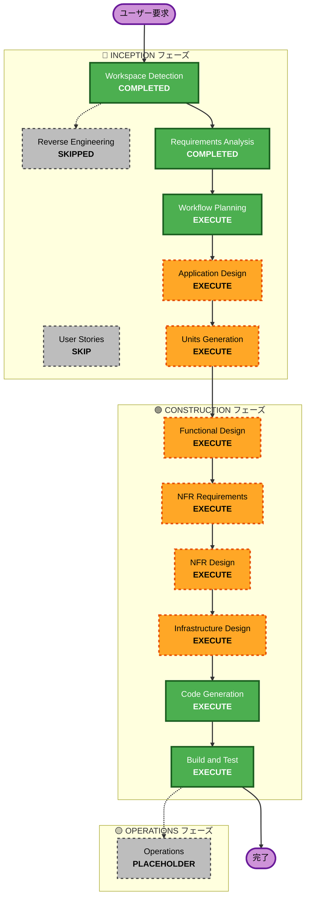

# 実行計画

**プロジェクト**: ブックマーク管理システム  
**作成日**: 2026-03-01  
**プロジェクトタイプ**: Greenfield（新規開発）

---

## 詳細分析サマリー

### 変更影響評価

**ユーザー向け変更**: はい
- Webアプリケーション（React）の新規開発
- ブックマークCRUD操作のUIを提供
- AWS Cognito 2要素認証によるログイン体験

**構造的変更**: はい
- 完全サーバーレスアーキテクチャの新規構築
- フロントエンド、バックエンド、認証、データ層の統合

**データモデル変更**: はい
- ブックマークデータモデルの設計
- SQLite スキーマ定義
- ユーザーデータとの関連付け

**API変更**: はい
- REST API（API Gateway + Lambda）の新規作成
- CRUD エンドポイントの定義
- Cognito JWT認証の統合

**NFR影響**: はい
- パフォーマンス: サーバーレスのコールドスタート対策
- セキュリティ: Cognito MFA、データアクセス制御
- コスト最適化: 無料枠活用、SQLite使用

### リスク評価

**リスクレベル**: 中程度
- **理由**: 新規開発だが、複数のAWSサービス統合が必要
- **ロールバック複雑度**: 容易（新規デプロイのため）
- **テスト複雑度**: 中程度（認証フロー、API統合、フロント・バック統合）

**主要リスク**:
1. SQLite同時書き込み競合（Lambda環境）
2. Cognito MFA設定の複雑さ
3. S3/Lambda間のSQLiteファイル同期
4. Lambda Cold Start遅延

---

## ワークフロー可視化

---

## 実行するフェーズ

### 🔵 INCEPTION フェーズ

#### ✅ 完了済み
- [x] **Workspace Detection** - 完了
  - Greenfield プロジェクトを確認
  
- [x] **Requirements Analysis** - 完了
  - 包括的な要件ドキュメント生成
  - 22の質問 + 4のフォローアップ質問で要件を明確化

#### ⏭️ スキップ
- [ ] **Reverse Engineering** - スキップ
  - **理由**: Greenfield プロジェクトのため、既存コードベース解析不要

- [ ] **User Stories** - スキップ
  - **理由**: 
    - 個人/小規模チーム向け（1-10ユーザー）
    - 要件が明確に定義済み
    - 短期間MVP（1-2週間）
    - ユースケースがシンプル（ブックマークCRUD + 検索 + 認証）
    - ストーリー分解よりも技術設計を優先

#### 🚀 実行予定
- [x] **Workflow Planning** - 実行中
  - 実行計画の作成

- [ ] **Application Design** - 実行
  - **理由**:
    - 新しいコンポーネントとサービス層が必要
    - React コンポーネント構造の設計
    - Lambda関数の責務分離
    - Cognito統合パターンの定義
    - データフローとコンポーネント間通信の設計

- [ ] **Units Generation** - 実行
  - **理由**:
    - 複数の開発ユニットが必要
    - 並行開発の可能性
    - 明確な責務分離が必要
  - **想定ユニット**:
    1. フロントエンドUI（React）
    2. 認証サービス（Cognito統合）
    3. ブックマークAPI（Lambda関数群）
    4. データアクセス層（SQLite操作）
    5. インフラストラクチャ（CDK/SAM）

### 🟢 CONSTRUCTION フェーズ

#### 🚀 実行予定

- [ ] **Functional Design（各ユニット）** - 実行
  - **理由**:
    - データモデル設計が必要（ブックマーク、ユーザー）
    - SQLiteスキーマ定義
    - APIエンドポイント設計
    - 検索アルゴリズム設計

- [ ] **NFR Requirements（各ユニット）** - 実行
  - **理由**:
    - セキュリティ要件あり（Cognito MFA、データアクセス制御）
    - パフォーマンス考慮（Lambda Cold Start、S3アクセス）
    - コスト最適化要件（無料枠活用）
    - 同時実行制御（SQLite書き込み競合）

- [ ] **NFR Design（各ユニット）** - 実行
  - **理由**:
    - Cognitoセキュリティパターンの実装設計
    - SQLite楽観的ロック実装
    - Lambda関数キャッシング戦略
    - API Gatewayスロットリング設定

- [ ] **Infrastructure Design（各ユニット）** - 実行
  - **理由**:
    - サーバーレスインフラの完全な設計が必要
    - S3バケット構成（フロントエンド、SQLiteストレージ）
    - CloudFront設定
    - API Gateway + Lambda統合
    - Cognito ユーザープール設定
    - IAMロールと権限設計

- [ ] **Code Generation（各ユニット）** - 実行（常に実行）
  - **理由**: コード実装が必要

- [ ] **Build and Test** - 実行（常に実行）
  - **理由**: ビルド、テスト、検証が必要

### 🟡 OPERATIONS フェーズ

- [ ] **Operations** - プレースホルダー
  - **理由**: 将来のデプロイメントとモニタリングワークフロー

---

## 推定タイムライン

**合計フェーズ**: 10フェーズ（実行）
**推定期間**: 1-2週間（要件通り）

### フェーズ別推定時間

| フェーズ | 推定時間 | 説明 |
|---------|---------|------|
| Application Design | 0.5日 | コンポーネント設計、アーキテクチャ図 |
| Units Generation | 0.5日 | ユニット分割、依存関係定義 |
| Functional Design（全ユニット） | 1-2日 | データモデル、API設計 |
| NFR Requirements（全ユニット） | 0.5日 | セキュリティ、パフォーマンス要件 |
| NFR Design（全ユニット） | 1日 | Cognito統合、Lambda最適化設計 |
| Infrastructure Design（全ユニット） | 1日 | CDK/SAMコード設計 |
| Code Generation（全ユニット） | 3-5日 | 実装、単体テスト |
| Build and Test | 1-2日 | 統合テスト、E2Eテスト |

**合計推定**: 8-12日（1.5-2.5週間）

---

## 成功基準

### 主要目標
完全に機能するブックマーク管理システムを1-2週間以内にデプロイ

### 主要成果物
1. React フロントエンドアプリケーション（S3 + CloudFront）
2. サーバーレスAPI（Lambda + API Gateway）
3. AWS Cognito 2要素認証システム
4. SQLite データベース（Lambda Layers + S3）
5. インフラストラクチャコード（CDK/SAM）
6. テストスイート（単体、統合、E2E）
7. デプロイメント手順書

### 品質ゲート
- [ ] すべてのCRUD操作が動作
- [ ] 2要素認証（SMS/TOTP/Email）が機能
- [ ] 基本検索機能が動作
- [ ] ユーザーは自分のデータのみアクセス可能
- [ ] ページロード5秒以内、APIレスポンス2秒以内
- [ ] 最新ブラウザ（Chrome、Firefox、Safari、Edge）で動作
- [ ] 月額コスト$5以下
- [ ] すべてのテストがパス

---

## ユニット構成（想定）

以下のユニットに分割予定（Units Generationフェーズで確定）：

### 1. Frontend Unit（フロントエンド）
- **責務**: ユーザーインターフェース、状態管理
- **技術**: React, TypeScript
- **主要コンポーネント**: 
  - ログイン/MFA画面
  - ブックマーク一覧
  - ブックマーク詳細/編集フォーム
  - 検索UI

### 2. Authentication Unit（認証）
- **責務**: Cognito統合、セッション管理
- **技術**: AWS Amplify Auth または Cognito SDK
- **主要機能**:
  - サインアップ/ログイン
  - MFA設定（SMS/TOTP/Email）
  - トークン管理

### 3. Bookmark API Unit（ブックマークAPI）
- **責務**: ビジネスロジック、CRUD操作
- **技術**: Node.js Lambda関数
- **主要エンドポイント**:
  - GET /bookmarks - 一覧取得
  - GET /bookmarks/{id} - 詳細取得
  - POST /bookmarks - 新規作成
  - PUT /bookmarks/{id} - 更新
  - DELETE /bookmarks/{id} - 削除
  - GET /bookmarks/search - 検索

### 4. Data Access Unit（データアクセス層）
- **責務**: SQLite操作、S3連携
- **技術**: SQLite（Lambda Layers）
- **主要機能**:
  - SQLiteファイルのS3読み込み/書き込み
  - クエリ実行
  - トランザクション管理
  - 楽観的ロック

### 5. Infrastructure Unit（インフラ）
- **責務**: AWSリソース定義、デプロイメント
- **技術**: AWS CDK または SAM
- **主要リソース**:
  - S3バケット（フロントエンド、DB）
  - CloudFront Distribution
  - API Gateway
  - Lambda関数群
  - Cognito User Pool
  - IAMロール

---

## 次のステップ

1. ✅ **現在**: Workflow Planning 完了待ち
2. 🚀 **次**: Application Design - コンポーネント設計
3. 続いて: Units Generation - ユニット分割確定
4. その後: Construction フェーズへ

---

## 変更履歴

| バージョン | 日付 | 変更内容 | 作成者 |
|-----------|------|---------|--------|
| 1.0 | 2026-03-01 | 初版作成 | AI-DLC System |
